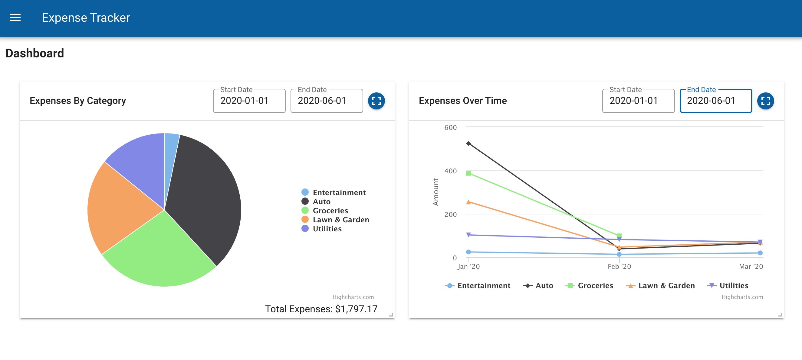
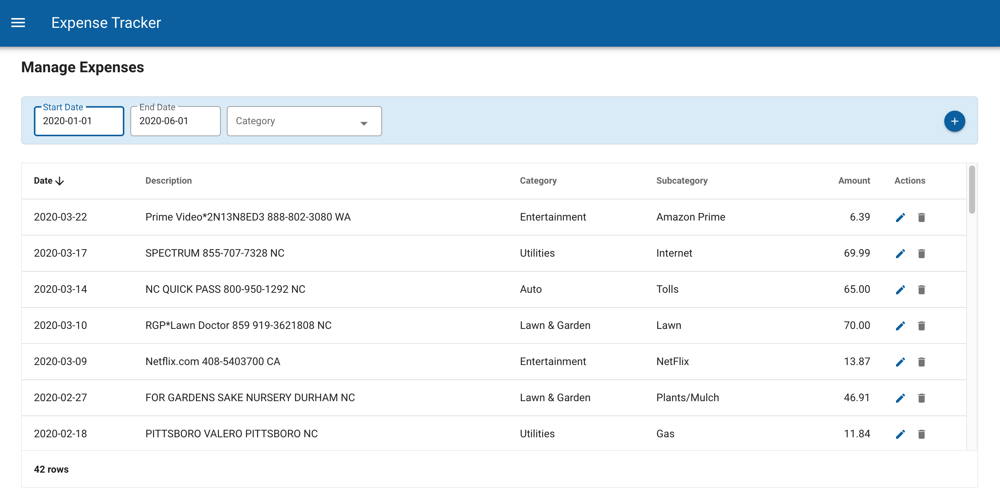
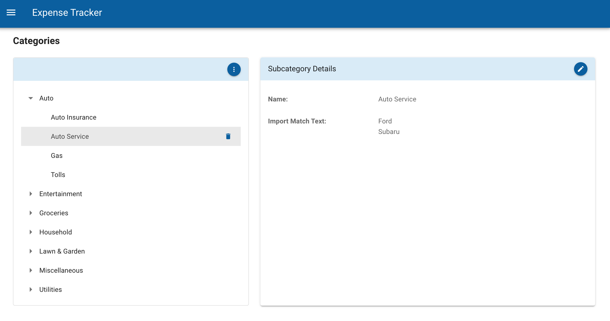

# vue-expense-tracker





## Summary
The vue-expense-tracker application allows users to enter and report on their expenses.

Features:
* Expense Category and Subcategory definition
* Expense Management, allowing adding, updating, deleting of expenses as well as assigning expenses to categories and subcategories
* Importing expenses from a csv file, along with automatically assigning category and subcategory to the imported expenses based on predefined category mapping text
* Displays expense summary data, filtered by date and category
* Dashboard with expense category pie chart and expenses time series chart

## Tech Stack
The server application is written in Javascript, Node, Express, Mongoose/MongoDB

The client web application is written in Javascript, Vue, Vuetify, Axios, Highcharts

## Dependencies
* Node and npm, which can be installed from https://nodejs.org/en/download/
* MongoDB, which can be installed from https://docs.mongodb.com/manual/installation/ and configured to run on port 27017
* Mongo Database Tools, which can be installed from https://www.mongodb.com/try/download/database-tools

## Install and run the Vue Expense Tracker web app in Developer mode

These install instructions were tested on Mac/OS and may need to be tweaked for Windows environment.

Before starting

* Make sure that node and npm have been installed
* Also make sure that MongoDB is running locally on port 27017 
* Verify that the mongodb and mongo database tools bin directories are in the user path (for mongo and mongoimport cmds)

Clone the vue-expense-tracker code
```shell
git clone https://github.com/LaeticiaW/vue-expense-tracker.git
```

Change to app directory
```shell
cd vue-expense-tracker
```

Install npm packages
```shell
npm run install-server
npm run install-client
```

Create the expenseTracker MongoDB collections and load sample data.
```shell
npm run set-permissions (only needed for linux environments, not windows)
npm run initialize-db
npm run load-data
```

Start the server app at http://localhost:3000 (leaves server running) and leave cmd window running
```shell
npm run start-server
```

From a new command window, start the client web app and display in browser at http://localhost:8080

```shell
cd vue-expense-tracker
npm run start-client
```


Notes about the Web App:

* To test out the Import Expenses feature, there is a sampleImportData.csv file in the vue-expense-tracker-server/database directory.  It loads records for the month of Apr 2020. (date format MM-DD-YYYY, date position 1, amt position 2, description position 5)
* When filtering expense data in the app, note that the sample data expense dates are all from Jan to Mar 2020

## Vue-Expense-Tracker WebApp Description

* There are 5 main menu options:  Dashboard, Categories, Manage Expenses, Expense Summary, and Imports.
* The Dashboard page displays a pie chart showing expenses by category and a time series chart showing category expenses over time.
* The Categories page allows users to View, Add, Update, and Delete categories and subcategories.
* The Manage Expenses page allows users to view/filter, add, update, and delete expenses.
* The Expense Summary page allows users to summarize expenses by date and category.
* The Import Expenses page allows importing expense transactions from a CSV file that contains the following fields: trxDate, amount, description.  The import process will automatically set category and subcategory values for expenses if there are any category mappings that match.
   
